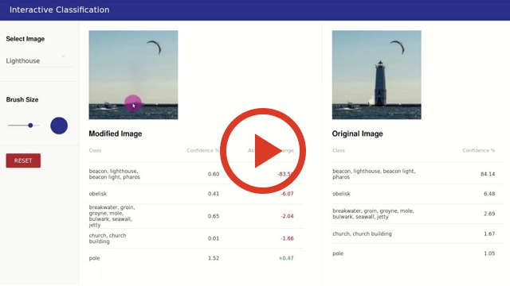
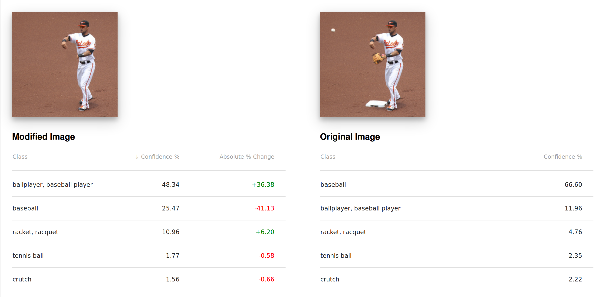

# Interactive Classification for Deep Learning Interpretation

We have designed and developed an interactive system that allows users to experiment with deep learning image classifiers and explore their robustness and sensitivity.
Selected areas of an image can be removed in real time with classical computer vision inpainting algorithms, allowing users to ask a variety of "what if" questions by experimentally modifying images and seeing how the deep learning model reacts.
The system also computes class activation maps for any selected class, which highlight the important semantic regions of an image the model uses for classification.
The system runs fully in browser using Tensorflow.js, React, and SqueezeNet. An advanced inpainting version is also available using a server running the PatchMatch algorithm from the [GIMP Resynthesizer plugin](https://github.com/bootchk/resynthesizer).

This is the code repository for the accepted [CVPR 2018](http://cvpr2018.thecvf.com) Demo: **Interactive Classification for Deep Learning Interpretation**. Visit our research group homepage [Polo Club of Data Science](https://poloclub.github.io) at [Georgia Tech](http://www.gatech.edu) for more related research!


## Video Demo
[](https://youtu.be/llub5GcOF6w)


## Example Usage Scenario: Interpreting "Failed" Classification


*"Dock" image incorrectly classified as "ocean liner" when the masts of a sailboat are removed.*

<!-- 

*The baseball player is correctly classified even when the ball, glove, and base are removed*
-->


## Installation

Download or clone this repository:

```bash
git clone https://github.com/poloclub/interactive-classification.git
```

Within the cloned repo, install the required packages with yarn:

```bash
yarn

```

## Usage

To run, type:

```bash
yarn start

```

## Advanced Inpainting

The following steps are needed to set up PatchMatch inpainting:

1. Clone the [Resynthesizer](https://github.com/bootchk/resynthesizer) repository and follow the instructions for building the project
2. Find the `libresynthesizer.a` shared library in the `lib` folder and copy it to the `inpaint` folder in this repository
3. Run `gcc resynth.c -L. -lresynthesizer -lm -lglib-2.0 -o prog` (may have to install glib2.0 first) to generate the prog executable
4. You can now run `python3 inpaint_server.py` and PatchMatch will be used as the inpainting algorithm.


## Citation

**Interactive Classification for Deep Learning Interpretation.**  
[Angel Cabrera][angel], [Fred Hohman][fred], [Jason Lin][jason], [Duen Horng (Polo) Chau][polo]  
*Demo, Conference on Computer Vision and Pattern Recognition (CVPR). June 18, 2018. Salt Lake City, USA.*

<!-- [Read the paper][paper].   -->
<!-- [Watch the video][video]. -->


## Researchers

|  Name                 | Affiliation                     |
|-----------------------|---------------------------------|
| [Angel Cabrera][angel]           | Georgia Tech |
| [Fred Hohman][fred]    | Georgia Tech |
| [Jason Lin][jason]        | Georgia Tech |
| [Duen Horng (Polo) Chau][polo]             | Georgia Tech |


## License

MIT License. See [`LICENSE.md`](LICENSE.md).


## Contact

For questions or support [open an issue][issues].

<!-- [paper]: "Paper" -->
[video]: https://youtu.be/llub5GcOF6w "Video"
[fred]: http://fredhohman.com "Fred Hohman"
[angel]: http://cabreraalex.com/ "Alex Cabrera"
[jason]: http://jlin.xyz/ "Jason Lin"
[polo]: http://www.cc.gatech.edu/~dchau/ "Polo Chau"
[issues]: https://github.com/poloclub/interactive-classification/issues "Issues"
